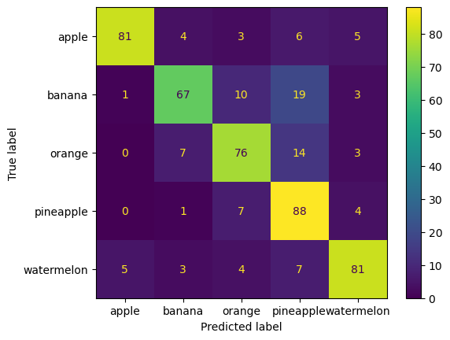
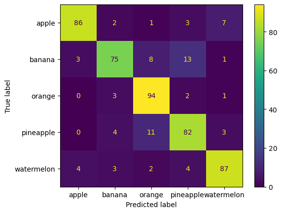
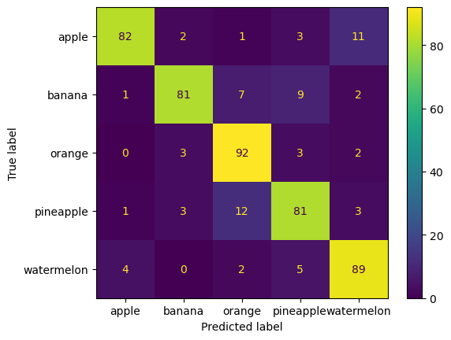
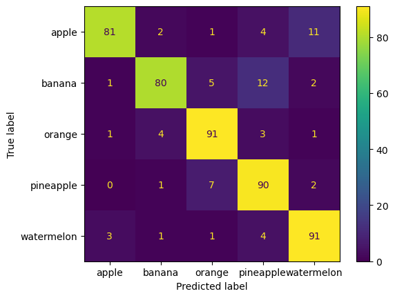
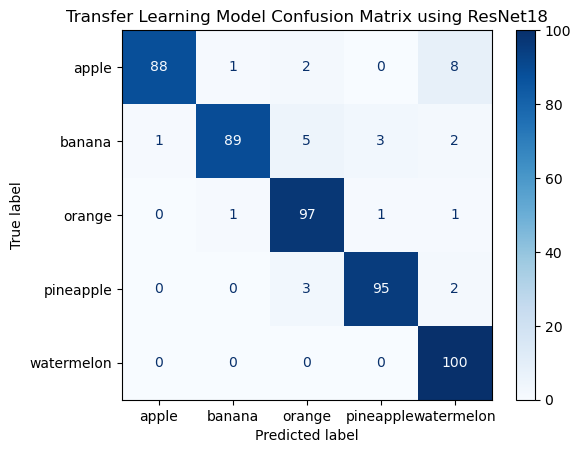
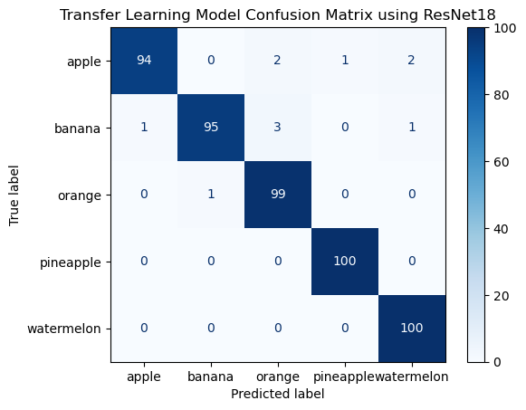

<div align="center">

# Fruit Image Classification Using CNNs and Transfer Learning by Agtheo09
by **Agtheo09**


</div>

This project explores the development and optimization of a deep learning image classification system for five fruit categories:

- Apple
- Banana
- Orange
- Pineapple
- Watermelon

The goal was to evaluate the impact of different deep learning techniques, including:

- CNN architecture improvements
- Data augmentation
- Batch normalization
- Dropout
- Optimizer tuning
- Weight decay
- Learning rate scheduling
- Transfer learning and fine-tuning

The custom CNN improved from **74% accuracy** to **86%**, while the final fine-tuned ResNet18 model achieved **98% accuracy**, demonstrating the effectiveness of transfer learning for small image datasets.

---

# Dataset

The dataset consists of RGB images divided into five fruit classes:

| Class      | Label |
| ---------- | ----: |
| Apple      |     0 |
| Banana     |     1 |
| Orange     |     2 |
| Pineapple  |     3 |
| Watermelon |     4 |

Dataset size:

| Dataset      | Number of Images |
| ------------ | ---------------: |
| Training set |             2500 |
| Testing set  |              500 |

The task is formulated as a multi-class image classification problem.

---

# Getting Started

## Installation

Clone the repository:

```
git clone https://github.com/Agtheo09/fruit-image-classifier.git
```

Install the required dependencies:
```
pip install -r requirements.txt
```
The project was developed with:

- Python 3.10
- PyTorch 2.13
- Torchvision 0.28
- NumPy 1.26
- Scikit-learn 1.7

# Experimental Methodology

Instead of immediately applying transfer learning, a custom CNN was first developed and optimized. Each experiment introduced specific improvements to measure their individual impact.

The experiments were:

1. Baseline CNN
2. Wider CNN with data augmentation
3. Batch normalization and dropout
4. Optimizer, loss-function improvements and Weight Decay
5. Transfer learning using ResNet18
6. Fine-tuning pretrained layers

---

# Experiment Results Summary

| Experiment / Model               | Main Changes                                                                                        |   Accuracy |
| -------------------------------- | --------------------------------------------------------------------------------------------------- | ---------: |
| Baseline CNN                     | Original CNN architecture                                                                           |    **74%** |
| CNN v2                           | Wider convolutions + data augmentation                                                              |    **78%** |
| CNN v3                           | Wider convolutions + data augmentation + Batch Normalization + Dropout                              |  **81.5%** |
| CNN v4                           | AdamW optimizer + weight decay + learning rate scheduler                                            |    **86%** |
| ResNet18 Frozen                  | Pretrained ResNet18 + ImageNet normalization + 224×224 input + frozen backbone + dropout classifier | **93.99%** |
| ResNet18 Fine-Tuning             | Last ResNet layers unfrozen and trained                                                             |  **95.5%** |
| ResNet18 Fine-Tuning (25 epochs) | Extended fine-tuning training                                                                       |    **98%** |

---

# Experiment 1 — Baseline CNN

The first model was a custom convolutional neural network trained completely from scratch.

The goal was to establish a baseline performance before applying optimization techniques.

The initial architecture contained:

- Convolution layers
- ReLU activations
- Pooling layers
- Fully connected classification layers

The achieved accuracy was:

```
74%
```

Confusion matrix:



---

# Experiment 2 — Increasing CNN Capacity and Data Augmentation

The second experiment focused on improving the feature extraction capability of the CNN.

Changes introduced:

- Increased number of convolution filters
- Wider convolution layers
- Data augmentation techniques

Applied augmentations:

- Random horizontal flipping
- Random rotations
- Color jitter

The purpose of augmentation was to increase image diversity and improve generalization.

The model achieved:

```
78%
```

Confusion matrix:



---
# Experiment 3 — Batch Normalization and Dropout

The third experiment focused on improving training stability and reducing overfitting.

Two important regularization techniques were introduced:

## Batch Normalization

Batch normalization normalizes intermediate feature activations during training.

Benefits:

- Faster convergence
- More stable gradients
- Improved generalization

## Dropout

Dropout randomly disables neurons during training.

Benefits:

- Prevents over-reliance on specific neurons
- Reduces overfitting
- Encourages more robust feature learning

After adding these improvements, the model achieved:

```
81.5%
```

Confusion matrix:



---

# Experiment 4 — Optimizer and Training Improvements

The next experiment focused on improving the optimization process.

The previous optimizer was replaced with AdamW.

## AdamW Optimizer

AdamW combines adaptive learning rates with decoupled weight decay.

Advantages:

- Better regularization
- Improved convergence
- More stable training compared to standard Adam in many cases

More information:

https://pytorch.org/docs/stable/generated/torch.optim.AdamW.html


## Weight Decay

Weight decay penalizes large weights and helps prevent overfitting.

## Learning Rate Scheduler

A ReduceLROnPlateau scheduler was used.

The learning rate was automatically reduced when improvement slowed.

This allows:

- Faster initial learning
- More precise final optimization

The final custom CNN achieved:

```
86%
```

Confusion matrix:



---

# Transfer Learning

After optimizing the custom CNN, transfer learning was investigated.

The motivation was that training deep CNNs from scratch requires large amounts of data.

Instead of learning all visual features from approximately 2500 images, a pretrained model was used.

---

# Experiment 5 — ResNet18 Frozen Feature Extractor

A pretrained ResNet18 model was loaded using ImageNet weights.

ResNet18 had already learned general visual features from millions of images, including:

- Edges
- Shapes
- Textures
- Object structures

The original ImageNet classifier:

```
1000 classes
```

was replaced with:

```
5 fruit classes
```

Training configuration:

- ResNet18 pretrained backbone
- Input size: 224×224
- ImageNet normalization
- Dropout classifier
- Frozen convolutional layers

The classifier was the only trainable part of the network.

The architecture:

```
Image
 |
ResNet18 feature extractor (frozen)
 |
Dropout
 |
Linear classifier
 |
5 fruit classes
```

Performance:

```
Accuracy: 93.99%
```

Confusion matrix:



---

# Experiment 6 — ResNet18 Fine-Tuning

The frozen ResNet18 model was further improved by allowing high-level features to adapt to the fruit dataset.

Instead of freezing the entire backbone, the final ResNet layers were trained.

Training strategy:

```
Layer 1  Frozen
Layer 2  Frozen
Layer 3  Frozen
Layer 4  Trainable
Classifier Trainable
```

This approach keeps the general visual knowledge learned from ImageNet while allowing the network to specialize for fruit classification.

A smaller learning rate was used:

```
learning rate = 0.0001
```

This prevents destroying pretrained features.

Result:

```
Accuracy: 95.5%
```

Confusion matrix:



---
# Experiment 7 — Extended ResNet18 Fine-Tuning

The final experiment used the same fine-tuned ResNet18 architecture but increased the training duration.

Configuration:

- Same pretrained ResNet18 model
- Same fine-tuning strategy
- 25 training epochs

The additional training allowed the model to further optimize high-level feature representations.

Final performance:

```
Accuracy: 98%
```

Confusion matrix:


---

# Accuracy Improvement Analysis

The complete improvement path is summarized below:

| Model                                        | Accuracy |
| -------------------------------------------- | -------: |
| Baseline CNN                                 |      74% |
| CNN with wider convolutions and augmentation |      78% |
| CNN with Batch Normalization and Dropout     |    81.5% |
| CNN with AdamW, weight decay and scheduler   |      86% |
| Frozen ResNet18 Transfer Learning            |   93.99% |
| ResNet18 Fine-Tuning                         |    95.5% |
| ResNet18 Fine-Tuning (25 epochs)             |      98% |

The overall improvement:

```
74% → 98%
```

represents a gain of:

```
+24 percentage points
```

---

# Discussion

The experiments demonstrate how different deep learning techniques contribute to model performance.

## Custom CNN Improvements

The custom CNN improved from:

```
74%
```

to:

```
86%
```

through:

- Increasing convolutional capacity
- Data augmentation
- Batch normalization
- Dropout
- Better optimization strategies

These techniques improved generalization and training stability.

However, the improvements were incremental.

---

## Impact of Transfer Learning

The largest performance improvement came from transfer learning.

The improvement:

```
86%

↓

93.99%
```

was achieved by replacing the custom feature extractor with a pretrained ResNet18.

This demonstrates that pretrained models contain powerful visual representations that can be reused for new tasks.

For small datasets, transfer learning provides a major advantage because the model does not need to learn low-level visual features from scratch.

---

## Impact of Fine-Tuning

Fine-tuning further improved the model:

```
93.99%

↓

98%
```

By allowing the final ResNet layers to adapt to fruit images, the model learned more specialized features:

- Fruit textures
- Shape differences
- Color patterns
- Class-specific visual characteristics

---

# Final Model Architecture

The final model consists of:

```
Input Image (224x224)

        |
        v

Pretrained ResNet18

        |
        v

Fine-tuned high-level features

        |
        v

Dropout

        |
        v

Fully Connected Layer

        |
        v

5 Fruit Classes
```

Final results:

| Metric          |  Result |
| --------------- | ------: |
| Accuracy        | **98%** |
| Classes         |       5 |
| Training Images |    2500 |
| Testing Images  |     500 |

---

# Technologies Used

- Python
- PyTorch
- Torchvision
- NumPy
- Matplotlib
- Scikit-learn

---

# Useful PyTorch Resources

## Convolutional Neural Networks

PyTorch CNN tutorial:

https://pytorch.org/tutorials/beginner/blitz/cifar10_tutorial.html


## Image Classification

PyTorch computer vision tutorials:

https://pytorch.org/tutorials/beginner/basics/quickstart_tutorial.html


## PyTorch Optimizers

Official optimizer documentation:

https://pytorch.org/docs/stable/optim.html

Includes:

- SGD
- Adam
- AdamW
- RMSprop
- Learning rate schedulers


## Transfer Learning

PyTorch transfer learning tutorial:

https://pytorch.org/tutorials/beginner/transfer_learning_tutorial.html

Covers:

- Feature extraction
- Fine-tuning
- Pretrained models


## Torchvision Pretrained Models

Available pretrained architectures:

https://pytorch.org/vision/stable/models.html

Includes:

- ResNet
- EfficientNet
- MobileNet
- Vision Transformers

# Single Image Prediction

A trained model can also be tested on individual images.

Run:
```
python prediction.py --image path/to/image.jpg
```
Example output:

Prediction probabilities:

- Apple: 97.12%
- Banana: 0.41%
- Orange: 1.02%
- Pineapple: 0.83%
- Watermelon: 0.62%

# Conclusion

This project demonstrates the importance of systematic experimentation in deep learning.

Starting from a simple CNN with 74% accuracy, multiple improvements were introduced:

- Better architectures
- Data augmentation
- Regularization
- Improved optimization
- Transfer learning
- Fine-tuning

The final model achieved:

```
98% accuracy
```

The main conclusion is that for relatively small image datasets, transfer learning combined with careful fine-tuning provides significantly better results than training a CNN from scratch.

The final ResNet18-based classifier provides a highly accurate and efficient solution for fruit image classification.
